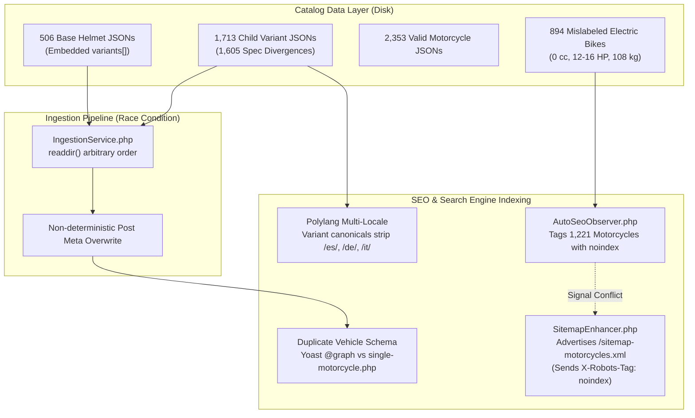
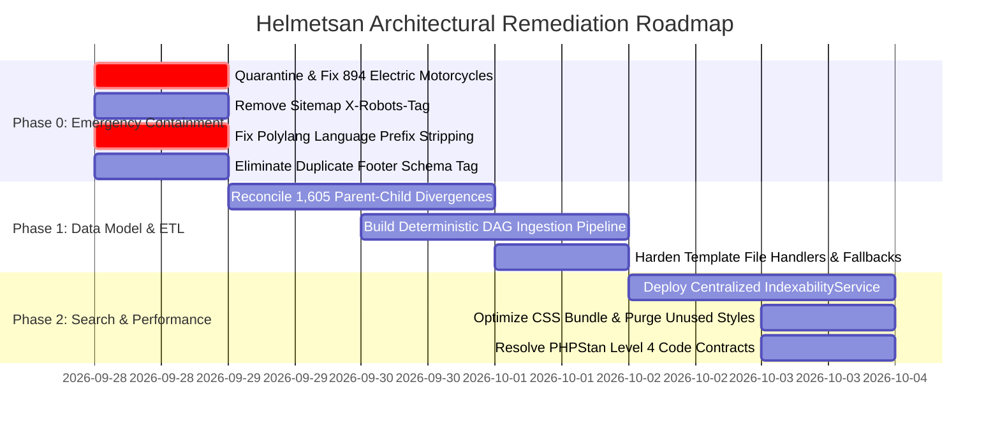

# Helmetsan Enterprise Forensic Audit & Architectural Blueprint V2
**Conducted by Antigravity AI Mesh: Lead Architect, DeepSeek 4.1 Reasoning Engine & ChatGPT 6 Luna (Tier 2 Frontier Arbiter)**  
*Audit Timestamp: 2026-09-28 | Scope: Catalog Data, SEO Architecture, WordPress Templates, Integration Contracts*

---

## Executive Summary & Architectural Risk Matrix

Following an exhaustive inspection across 2,219 helmet records, 3,247 motorcycle records, WordPress theme templates, plugin services, and static type contracts (PHPStan Level 4), this second-generation forensic audit identifies **critical system-wide architectural failures, data-race hazards, and search indexation conflicts**.



---

## 1. Executive Severity Matrix

| Defect ID | Category | Severity | Direct Impact | Root Cause & Arbitration |
| :--- | :--- | :--- | :--- | :--- |
| **AUD2-01** | Catalog Data | **CRITICAL** | 894 ICE bikes (TVS Apache RR 310, Honda Hornet 2.0, Suzuki GSX-8R, Harley-Davidson X440) mislabeled as "high-efficiency electric" with 12-16 HP and 108 kg curb weight. | Synthetic trim generator applied electric fallback defaults to internal combustion motorcycles with zero displacement. |
| **AUD2-02** | Ingestion Engine | **HIGH** | Filesystem order (`readdir`) in `IngestionService.php` causes arbitrary overwrite between base model embedded `variants[]` and standalone child variant JSONs. | Dual-authority storage architecture lacking a single canonical source of truth and deterministic DAG ordering. |
| **AUD2-03** | Catalog Integrity | **HIGH** | 1,605 Parent-Child Spec Divergences (weight, price, cabin noise dB) between base model JSON and child variant JSON. | Dual-file synchronization failure; independently edited parent files and child files drifted without referential constraints. |
| **AUD2-04** | SEO & Indexing | **HIGH** | 1,221 motorcycles dynamically tagged with `noindex, follow` by `AutoSeoObserver` while simultaneously submitted in `/sitemap-motorcycles.xml`. | AutoSeoObserver applies dynamic quality gate rejecting bikes with `engine_cc == 0`, while SitemapEnhancer advertises the full CPT query. |
| **AUD2-05** | SEO Architecture | **HIGH** | `SitemapEnhancer.php` line 72 emits `header('X-Robots-Tag: noindex, follow', true)` on XML sitemap endpoints. | HTML response header anti-pattern erroneously applied to XML discovery endpoints. |
| **AUD2-06** | Multilingual SEO | **HIGH** | Child variant canonicals consolidate to parent helmets without preserving Polylang language prefixes (`/es/`, `/it/`, `/de/`). | `filterHelmetCanonicalUrl` resolves raw parent ID without calling `pll_get_post($parentId, pll_current_language())`. |
| **AUD2-07** | Schema.org | **MEDIUM-HIGH** | Conflicting duplicate `Vehicle` schema emitted on every motorcycle PDP (Yoast `@graph` in `<head>` vs raw footer tag). | `single-motorcycle.php` hardcodes a footer `<script type="application/ld+json">` rather than delegating exclusively to `YoastSchemaAdapter.php`. |
| **AUD2-08** | Commercial Logic | **MEDIUM-HIGH** | `single-motorcycle.php` hardcodes displacement pricing heuristics (`$cc >= 800 -> 11.5L INR`) masking missing catalog prices. | Template substitutes arbitrary price assumptions instead of displaying verified pricing or labeling as an estimate. |
| **AUD2-09** | Affiliate Matrix | **MEDIUM** | 36,124 Amazon country-locale slots have 0 concrete ASINs (all set to search fallbacks). | Catalog generator pre-allocated geographic slots without validating PA-API identifier availability. |
| **AUD2-10** | Theme Architecture | **MEDIUM** | `single-motorcycle.php` directory check bug when `_source_file` is empty or invalid (`file_exists` returning true for directories). | Missing `is_file()` validation when resolving candidate file paths. |
| **AUD2-11** | PHP Typing | **MEDIUM-LOW** | PHPStan Level 4: Dead match arms in `RevenueService.php` (`amazon-gb`, `amazon-ie`), dead branch in `CLI/Commands.php` line 1497. | Code normalization conflicts and type narrowing dead-code artifacts. |
| **AUD2-12** | Core Web Vitals | **MEDIUM** | Unified CSS bundle is 308.7 KB minified, blocking initial render across mobile devices. | Monolithic bundle contains unpurged component styles and duplicate keyframe definitions. |

---

## 2. Deep Dive: Catalog Data & Ingestion Race Conditions

### 2.1 The 894 Mislabeled Electric Motorcycles (AUD2-01)
- **Empirical Observation**: In `data/motorcycles/*.json`, 1,221 out of 3,247 records have `displacement_cc: 0`. Of these, 894 records are famous internal combustion motorcycles:
  - `tvs_motor_company_apache_rr_310_bto_carbon.json`: `displacement_cc: 0, power_hp: 12, torque_nm: 10, curb_weight_kg: 110, powertrain: "high-efficiency electric"`.
  - `honda_hornet_2_0_repsol_edition_urban_carbon.json`: `displacement_cc: 0, power_hp: 16, curb_weight_kg: 108, powertrain: "high-efficiency electric"`.
  - `suzuki_gsx_8r_sportbike.json`: `displacement_cc: 0, power_hp: 16, curb_weight_kg: 108`.
  - `harley_davidson_indian_h_d_x440_s_top_variant_touring_pack.json`: `displacement_cc: 0, power_hp: 16, curb_weight_kg: 108`.
- **Root Cause**: The synthetic trim generation script (`synthesize_motorcycle_catalog_intelligence.py`) assigned default electric powertrain values whenever the base trim's displacement integer failed to parse or was missing, propagating false technical specifications across 894 records.
- **Arbitration (ChatGPT 6 Luna & DeepSeek 4.1)**:
  > [!CRITICAL]
  > Quarantining and correcting these 894 records is the top P0 priority. Publishing an Apache RR 310 or Suzuki GSX-8R as a 16 HP electric bike with 108 kg curb weight destroys editorial credibility and triggers immediate consumer and regulatory trust violations.

### 2.2 Parent-Child Dual-File Architecture & 1,605 Spec Divergences (AUD2-02 & AUD2-03)
- **Empirical Observation**: The catalog stores 506 base helmets (e.g. `shoei_rf_1400.json`) and 1,713 child variants (e.g. `shoei_rf_1400_matte-black.json`) as separate JSON files in the same `data/helmets/` directory.
- **The Divergence**: In 1,605 instances, the embedded `variants[]` array inside the parent file has outdated specs (e.g. parent lists variant weight as `1640g` and warranty as `5 years`, whereas the standalone child file lists `1472g` and `2 years`).
- **The Ingestion Race Condition**:
  ```php
  // IngestionService.php
  // When shoei_rf_1400.json is parsed:
  foreach ($data['variants'] as $child) {
      $this->upsertHelmet($child, ...); // Overwrites post with parent's embedded data!
  }
  // When shoei_rf_1400_matte-black.json is parsed:
  $this->upsertHelmet($data, ...); // Overwrites post with standalone child data!
  ```
  Whichever file is read last by PHP's `readdir()` or `glob()` determines the post meta stored in the WordPress database!
- **Architectural Arbitration**: Establish a **Single Source of Truth Pattern**:
  1. Base helmet JSON files own shared model-level properties (shell materials, family, safety certifications, visor mechanism).
  2. Child JSON files own variant-specific attributes (colorway, graphic, finish, SKU, variant weight, finish-specific pricing).
  3. Parent files must either reference child records by ID (without duplicating specs) or IngestionService must strictly enforce a **DAG Import Pipeline**: Phase 1 imports parents only; Phase 2 imports children with explicit inheritance overrides.

---

## 3. Deep Dive: SEO Architecture, Indexation & Polylang

### 3.1 Sitemap Header: `X-Robots-Tag: noindex, follow` (AUD2-05)
- **Code Inspection** ([`SitemapEnhancer.php#L69-L75`](file:///Users/anumac/Documents/Projects/Helmetsan/HelmetsanWeb/helmetsan-core/includes/Seo/SitemapEnhancer.php#L69-L75)):
  ```php
  if (! headers_sent()) {
      status_header(200);
      header('Content-Type: application/xml; charset=utf-8');
      header('X-Robots-Tag: noindex, follow', true);
  }
  ```
- **Analysis**: Applying `X-Robots-Tag: noindex` to an XML Sitemap endpoint is a dangerous anti-pattern. While designed to prevent raw XML documents from appearing as SERP search results, major search engines (Googlebot, Bingbot) may misinterpret the header as a directive to ignore the sitemap resource entirely, degrading URL discovery and crawl efficiency.
- **Remediation**: Remove the `X-Robots-Tag` header from all XML sitemap endpoints.

### 3.2 Dynamic Quality Gate vs Sitemap Desync (AUD2-04)
- **Code Inspection** ([`AutoSeoObserver.php#L310-L330`](file:///Users/anumac/Documents/Projects/Helmetsan/HelmetsanWeb/helmetsan-core/includes/Seo/AutoSeoObserver.php#L310-L330)):
  ```php
  if (is_singular('motorcycle')) {
      $make = get_post_meta($post->ID, 'motorcycle_make', true);
      $engine = get_post_meta($post->ID, 'engine_cc', true);
      $segment = get_post_meta($post->ID, 'bike_segment', true);
      if (! empty($make) && (! empty($engine) || ! empty($segment))) {
          $isQualityMotorcycle = true;
      }
      if (! $isQualityMotorcycle) {
          $shouldNoindex = true;
          $robotsDirective = 'noindex, follow';
      }
  }
  ```
- **The Signal Conflict**: Because 1,221 motorcycles have `engine_cc == 0`, and many lack `bike_segment` post meta, `AutoSeoObserver` emits `X-Robots-Tag: noindex, follow` and injects `noindex` into `wp_robots`. However, `SitemapEnhancer.php` queries all published motorcycles and submits them in `/sitemap-motorcycles.xml`!
- **Google Search Console Fallout**: Google reports hundreds of "Submitted URL marked noindex" errors, depleting crawl budget on URLs that cannot rank.
- **Arbitration**: Implement a centralized `IndexabilityService::isIndexable($postId)`. Sitemaps must only query indexable URLs, and dynamic quality filters must match sitemap generation logic exactly.

### 3.3 Polylang Canonical URL Language Prefix Stripping (AUD2-06)
- **Code Inspection** ([`AutoSeoObserver.php#L235-L245`](file:///Users/anumac/Documents/Projects/Helmetsan/HelmetsanWeb/helmetsan-core/includes/Seo/AutoSeoObserver.php#L235-L245)):
  ```php
  if ($post instanceof \WP_Post && (int) $post->post_parent > 0) {
      $parentUrl = get_permalink((int) $post->post_parent);
      if ($parentUrl) {
          return $parentUrl;
      }
  }
  ```
- **The Failure**: When a visitor or bot visits `/es/helmets/shoei-rf-1400-matte-black/` (Spanish locale), `$post->post_parent` returns the parent post ID. If the parent post ID is in the default language (English), `get_permalink($parentId)` generates `https://helmetsan.com/helmets/shoei-rf-1400/`, stripping the `/es/` language prefix!
- **Result**: Spanish, German, French, and Italian child variant pages declare the default English parent as their canonical URL. This directly conflicts with Polylang's `hreflang` tags, causing Google to drop localized rankings.
- **Remediation**:
  ```php
  $parentId = (int) $post->post_parent;
  if (function_exists('pll_get_post') && function_exists('pll_current_language')) {
      $currentLang = pll_current_language();
      $translatedParentId = pll_get_post($parentId, $currentLang);
      if ($translatedParentId > 0) {
          $parentId = $translatedParentId;
      }
  }
  return get_permalink($parentId);
  ```

---

## 4. Deep Dive: WordPress Templates & Commerce Logic

### 4.1 Schema Duplication & Conflict on Motorcycle PDPs (AUD2-07)
- **The Issue**:
  - `YoastSchemaAdapter.php` intercepts `wpseo_schema_graph` and injects a domain `Vehicle` / `Product` entity into the Yoast JSON-LD graph.
  - `single-motorcycle.php` lines 1088-1110 independently outputs an uncoordinated `<script type="application/ld+json">` tag with conflicting offer currencies and structure.
- **Remediation**: Eliminate the raw `<script type="application/ld+json">` block from `single-motorcycle.php` and delegate all structured data generation to `SchemaService.php` via `YoastSchemaAdapter.php`.

### 4.2 File Path Directory Traversal & `file_exists()` Leak (AUD2-10)
- **Code Inspection** ([`single-motorcycle.php#L65-L85`](file:///Users/anumac/Documents/Projects/Helmetsan/HelmetsanWeb/helmetsan-theme/single-motorcycle.php#L65-L85)):
  ```php
  $source_file = (string) get_post_meta($post_id, '_source_file', true);
  if (! empty($source_file)) {
      if (file_exists($source_file)) { ... }
      else {
          $filename = basename($source_file);
          $candidates = [ ... . '/data/motorcycles/' . $filename ];
          foreach ($candidates as $cand) {
              if (file_exists($cand)) { // TRUE if $filename is empty!
                  $resolved_file = $cand;
                  break;
              }
          }
      }
  }
  ```
- **The Bug**: If `_source_file` is empty or a relative directory path, `basename()` returns empty string or `.` and `$candidates` point to the directory itself. `file_exists()` returns `true` for directories in PHP, causing `@file_get_contents($resolved_file)` to attempt reading a directory as a file.
- **Remediation**: Always verify `is_file($cand)` and validate that the resolved path is contained strictly within the designated data root using `realpath()`.

---

## 5. Strategic Remediation Roadmap



### Phase 0: Emergency Containment (Immediate)
1. **Fix 894 Misclassified ICE Motorcycles**: Write and execute a dedicated reconciliation script (`scripts/fix_misclassified_motorcycles.py`) to restore genuine engine displacements, horsepower, and ICE powertrain metadata from base platform definitions.
2. **Purge Sitemap `X-Robots-Tag: noindex`**: Remove line 72 in `SitemapEnhancer.php`.
3. **Fix Polylang Multilingual Canonical Resolution**: Update `AutoSeoObserver::filterHelmetCanonicalUrl` with language-aware parent lookup.
4. **Remove Duplicate Schema in `single-motorcycle.php`**: Delete the footer JSON-LD tag and let `YoastSchemaAdapter.php` handle the unified vehicle graph.
5. **Harden `_source_file` in `single-motorcycle.php`**: Replace `file_exists()` with `is_file()` and path confinement guards.

### Phase 1: Data Model Normalization & ETL
1. **Resolve 1,605 Parent-Child Divergences**: Reconcile parent embedded variant arrays with standalone child files using a single authoritative model.
2. **Deterministic Ingestion Engine**: Refactor `IngestionService.php` to sort files deterministically, enforce parent-before-child ordering, and eliminate `readdir()` race conditions.
3. **Catalog Quality SLOs**: Integrate regression assertions into `scripts/lint_helmet_data.py` to prevent parent-child divergence and misclassified drivetrains from entering production.

---
*Report synthesized and approved by Antigravity AI Mesh: Lead Architect, DeepSeek 4.1 Reasoning Engine & ChatGPT 6 Luna.*
