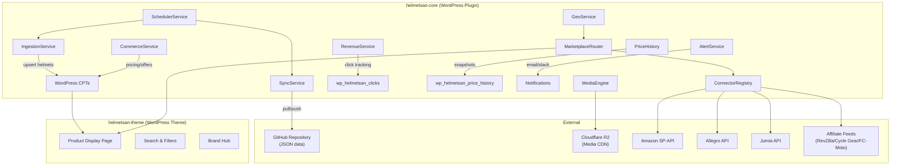
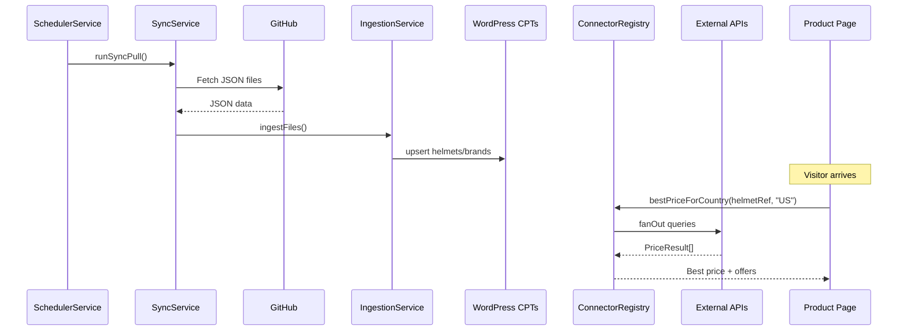

# Helmetsan — Architecture Overview

> The global motorcycle helmet comparison and affiliate platform.

## System Diagram

## Module Catalogue

Modules are grouped by domain. Each has a detailed doc in [`docs/modules/`](file:///Users/anumac/Documents/Helmetsan/docs/modules/).

### 🔄 Data Pipeline

| Module                                                                            | Service            | Purpose                               |
| --------------------------------------------------------------------------------- | ------------------ | ------------------------------------- |
| [Sync](file:///Users/anumac/Documents/Helmetsan/docs/modules/sync.md)             | `SyncService`      | GitHub ↔ WordPress bidirectional sync |
| [Ingestion](file:///Users/anumac/Documents/Helmetsan/docs/modules/ingestion.md)   | `IngestionService` | JSON → WordPress CPT processing       |
| [Repository](file:///Users/anumac/Documents/Helmetsan/docs/modules/data-layer.md) | `JsonRepository`   | Local JSON file management            |
| [Validation](file:///Users/anumac/Documents/Helmetsan/docs/modules/data-layer.md) | `Validator`        | Schema validation & integrity checks  |

### 🛒 Commerce & Marketplace

| Module                                                                              | Service                         | Purpose                             |
| ----------------------------------------------------------------------------------- | ------------------------------- | ----------------------------------- |
| [Commerce](file:///Users/anumac/Documents/Helmetsan/docs/modules/commerce.md)       | `CommerceService`               | Pricing, offers, marketplace data   |
| [Marketplace](file:///Users/anumac/Documents/Helmetsan/docs/modules/marketplace.md) | `ConnectorRegistry`             | Multi-marketplace price engine      |
| [Price](file:///Users/anumac/Documents/Helmetsan/docs/modules/price.md)             | `PriceService` + `PriceHistory` | Currency formatting, price tracking |
| [Revenue](file:///Users/anumac/Documents/Helmetsan/docs/modules/revenue.md)         | `RevenueService`                | Affiliate link tracking & reporting |

### 🌍 Geo & Routing

| Module                                                              | Service             | Purpose                       |
| ------------------------------------------------------------------- | ------------------- | ----------------------------- |
| [Geo](file:///Users/anumac/Documents/Helmetsan/docs/modules/geo.md) | `GeoService`        | Visitor country detection     |
| Marketplace Router                                                  | `MarketplaceRouter` | Country → marketplace routing |

### 🖼️ Media

| Module                                                                  | Service                        | Purpose                           |
| ----------------------------------------------------------------------- | ------------------------------ | --------------------------------- |
| [Media](file:///Users/anumac/Documents/Helmetsan/docs/modules/media.md) | `MediaEngine` + `MediaService` | Logo management, galleries, video |

### 📊 Analytics & Monitoring

| Module                                                                          | Service                    | Purpose                                |
| ------------------------------------------------------------------------------- | -------------------------- | -------------------------------------- |
| [Analytics](file:///Users/anumac/Documents/Helmetsan/docs/modules/analytics.md) | `Tracker` + `EventService` | GA4/GTM/Clarity/Hotjar + custom events |
| [Health](file:///Users/anumac/Documents/Helmetsan/docs/modules/health.md)       | `HealthService`            | System health dashboard                |
| [Alerts](file:///Users/anumac/Documents/Helmetsan/docs/modules/alerts.md)       | `AlertService`             | Email + Slack notifications            |

### ⚙️ Infrastructure

| Module                                                                          | Service            | Purpose                              |
| ------------------------------------------------------------------------------- | ------------------ | ------------------------------------ |
| [Scheduler](file:///Users/anumac/Documents/Helmetsan/docs/modules/scheduler.md) | `SchedulerService` | WP-Cron job orchestration            |
| [Config](file:///Users/anumac/Documents/Helmetsan/docs/modules/config.md)       | `Config`           | Centralized settings + env overrides |
| [CLI](file:///Users/anumac/Documents/Helmetsan/docs/modules/cli.md)             | `Commands`         | WP-CLI command registration          |
| [Admin](file:///Users/anumac/Documents/Helmetsan/docs/modules/admin.md)         | `Admin`            | WP Admin dashboard pages             |

### 📦 Content Types

| Module                                                                                     | Service                       | Purpose                   |
| ------------------------------------------------------------------------------------------ | ----------------------------- | ------------------------- |
| [CPT](file:///Users/anumac/Documents/Helmetsan/docs/modules/cpt.md)                        | `Registrar` + `MetaRegistrar` | Custom post types & meta  |
| [Brands](file:///Users/anumac/Documents/Helmetsan/docs/modules/content-types.md)           | `BrandService`                | Brand CPT management      |
| [Helmets](file:///Users/anumac/Documents/Helmetsan/docs/modules/content-types.md)          | `HelmetService`               | Helmet CPT management     |
| [Accessories](file:///Users/anumac/Documents/Helmetsan/docs/modules/content-types.md)      | `AccessoryService`            | Accessory CPT management  |
| [Motorcycles](file:///Users/anumac/Documents/Helmetsan/docs/modules/content-types.md)      | `MotorcycleService`           | Motorcycle CPT management |
| [Safety Standards](file:///Users/anumac/Documents/Helmetsan/docs/modules/content-types.md) | `SafetyStandardService`       | ECE/DOT/Snell standards   |
| [Dealers](file:///Users/anumac/Documents/Helmetsan/docs/modules/content-types.md)          | `DealerService`               | Dealer directory          |
| [Distributors](file:///Users/anumac/Documents/Helmetsan/docs/modules/content-types.md)     | `DistributorService`          | Distributor directory     |

### 🔗 Integrations

| Module                                                                          | Service            | Purpose                              |
| ------------------------------------------------------------------------------- | ------------------ | ------------------------------------ |
| [WooBridge](file:///Users/anumac/Documents/Helmetsan/docs/modules/woobridge.md) | `WooBridgeService` | Helmet → WooCommerce product sync    |
| [Search](file:///Users/anumac/Documents/Helmetsan/docs/modules/search.md)       | `SearchService`    | Enhanced search with meta + taxonomy |

## Data Flow

## Plugin Bootstrap

All services are initialized in [`Plugin.php`](file:///Users/anumac/Documents/Helmetsan/helmetsan-core/includes/Core/Plugin.php):

1. **Constructor** — Creates all service instances with dependency injection
2. **`boot()`** — Registers WordPress hooks for each service
3. **`activate()`** — Creates custom DB tables, schedules cron jobs
4. **`deactivate()`** — Clears cron schedules

## Key Design Principles

- **JSON-first data** — Helmet data lives as JSON in GitHub, synced to WordPress
- **Pluggable connectors** — Marketplace integrations via `MarketplaceConnectorInterface`
- **Geo-aware pricing** — Visitors see prices from their country's marketplaces
- **Error isolation** — One marketplace failure doesn't break the whole price display
- **Config-driven** — All features toggleable via `wp_options` with env-var overrides
