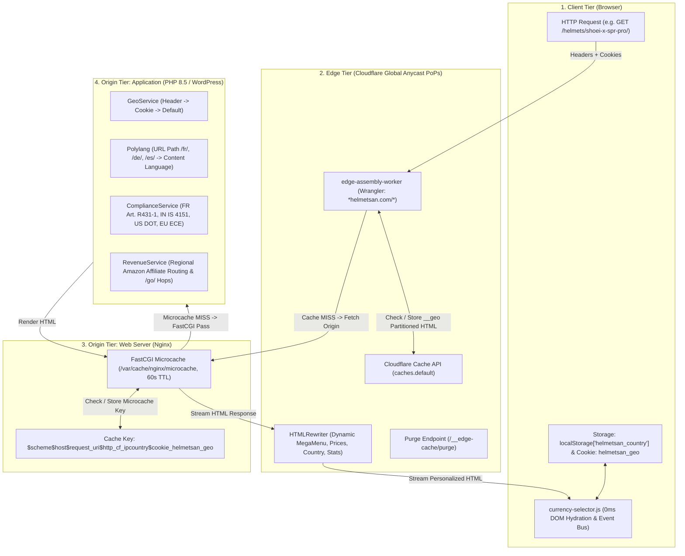

# Master Architecture & Workflow Strategy: Cloudflare Edge & Origin Ecosystem

A comprehensive, strategic blueprint detailing the entire request lifecycle, multi-tier caching architecture, geographic/language decoupling, and security boundaries across **Helmetsan**.

---

## 1. High-Level Architecture Topology



---

## 2. Request Lifecycle: Step-by-Step Traversal

### Step 1: Client Request & Identification
* **Incoming Request**: User requests `https://helmetsan.com/helmets/shoei-x-spr-pro/`.
* **Headers Attached by Cloudflare Edge**:
  * `CF-IPCountry`: Detected ISO-3166-1 alpha-2 country (e.g., `FR`, `IN`, `US`, `DE`).
  * `CF-Connecting-IP`: Visitor client IP.
* **Cookies Carried**:
  * `helmetsan_geo`: Optional user-selected country preference (e.g., `FR` or `IN`).

### Step 2: Cloudflare Edge Assembly Worker
1. **Bypass Checks**:
   * If method is `POST`, `PUT`, `DELETE` -> Pass through.
   * If path is static asset (`.css`, `.js`, `.webp`, `.avif`) -> Pass through to Cloudflare CDN cache.
   * If path is `/wp-admin/`, `/wp-login.php`, or `/wp-json/` -> Pass through to origin.
   * If path is `/go/*` (affiliate redirect) -> Pass through to origin.
2. **Language & Country Resolution**:
   * **Language**: Derived purely from URL prefix (`/fr/` -> French, `/de/` -> German, default -> English).
   * **Country**:
     1. `?country=XX` (URL query override)
     2. `Cookie: helmetsan_geo=XX` (User explicit modal selection)
     3. `CF-IPCountry` (Cloudflare geographical header)
     4. Default fallback: `IN`
3. **Edge Cache Lookup (`caches.default`)**:
   * Canonical Cache Key:
     ```text
     https://helmetsan.com/helmets/shoei-x-spr-pro/?__v=v2_20260907_03&__geo=FR
     ```
   * **HIT**: Edge immediately serves cached HTML with `CF-Edge-Cache: HIT` (sub-30ms global TTFB).
   * **MISS**: Edge forwards request to origin server.

### Step 3: Origin Nginx FastCGI Microcache
1. **Nginx Microcache Evaluation**:
   * Evaluates partitioned key:
     ```nginx
     fastcgi_cache_key "$scheme$host$request_uri$http_cf_ipcountry$cookie_helmetsan_geo";
     ```
   * **Hit**: Nginx returns 60-second cached HTML (`X-FastCGI-Cache: HIT`), protecting PHP-FPM from traffic spikes.
   * **Miss**: Passes request via Unix socket to PHP-FPM pool (`php8.5-helmetsan_com.sock`).

### Step 4: WordPress Application Generation
1. `GeoService::getCountry()` identifies active market (`FR`).
   * *Security rule*: No `Set-Cookie` is emitted on passive IP detection.
2. `ComplianceService` & `helmetsan_resolve_road_legality()`:
   * Evaluates helmet certifications for France: Homologation ECE 22.06 + **Article R431-1 retro-reflective stickers mandate**.
3. `RevenueService`:
   * Pre-configures Amazon France (`www.amazon.fr`, tag `vtete-20`).
4. PHP outputs complete HTML document.

### Step 5: Edge Assembly & HTMLRewriter Streaming
1. Edge worker receives origin HTML stream.
2. `HTMLRewriter` dynamically transforms elements in flight:
   * `#hsCurrentFlag`, `#hsCurrentCountry`, `#hsCurrentCode`, `#hsCurrentCurrency`: Injects `🇫🇷`, `France`, `FR`, `(€)`.
   * `.hs-country-card[data-country-code="FR"]`: Adds `.is-active` and `aria-selected="true"`.
   * `.hs-price`: Calculates 20% French TVA and charm rounding (`299,99 €`).
   * MegaMenu & Homepage stats cards: Injected dynamically.
3. **Edge Cache Storage**:
   * Strips any `Set-Cookie` header (`cacheHeaders.delete('Set-Cookie')`).
   * Saves response under `?__v=...&__geo=FR` in `caches.default`.
4. Streams transformed HTML to the visitor.

### Step 6: Client-Side Hydration (0ms)
1. Browser renders pre-compiled HTML with zero layout shift.
2. `currency-selector.js` initializes:
   * Re-evaluates Road Legality badge, import duties, and outbound affiliate links.
   * Listens for country modal interaction.
   * When user selects a different country:
     * Saves to `localStorage['helmetsan_country']`.
     * Sets cookie `helmetsan_geo=XX`.
     * Instantly updates UI elements without a page reload.

---

## 3. The Decoupling Matrix: Language vs Geography

| Dimension | Managed By | Mechanism | Examples |
| :--- | :--- | :--- | :--- |
| **Content Language** | Polylang Core | URL Subdirectory (`/`, `/fr/`, `/de/`, `/es/`, `/it/`, `/ja/`) | French copy on `/fr/`, German copy on `/de/` |
| **Commerce & Currency** | Edge Worker & `GeoService` | `CF-IPCountry` header / `helmetsan_geo` cookie | `EUR (€)` in France/Germany, `INR (₹)` in India, `USD ($)` in USA |
| **Road Legality Standard** | `ComplianceService` & Theme Helper | Country code resolution | **France**: ECE 22.06 + Art. R431-1 stickers<br>**India**: IS 4151 BIS standard<br>**USA**: FMVSS 218 DOT / Snell<br>**Germany**: ECE 22.06 EU standard |
| **Affiliate Store** | `RevenueService` & JS | Regional marketplace table | `Amazon.fr` for France, `Amazon.de` for Germany, `Amazon.in` for India |

---

## 4. Multi-Tier Cache Isolation & Invalidation Matrix

| Tier | Cache Key Structure | TTL | Invalidation Trigger |
| :--- | :--- | :--- | :--- |
| **Cloudflare Edge Cache** | `${origin}${pathname}?__v=${ver}&__geo=${country}` | 2 hours fresh, 24h stale-while-revalidate | `CloudflareCacheService::purgeUrls()` -> Iterates all regional keys in Worker |
| **Origin Nginx FastCGI** | `"$scheme$host$request_uri$http_cf_ipcountry$cookie_helmetsan_geo"` | 60 seconds microcache | Nginx fastcgi_cache TTL expiry (60s) or administrative purge |
| **WordPress Transients** | `hs_mega_menu_${type}_${lang}` & `hs_homepage_counts_${lang}` | 12 hours | Admin post save hook or transient expiration |
| **Browser Storage** | `localStorage['helmetsan_country']` | Persistent | User modal selection or cache reset |

---

## 5. Security & Poisoning Protection Rules

1. **No Shared `Set-Cookie`**: Shared edge caches must never store `Set-Cookie` headers (RFC 7234 compliance).
2. **No Passive Cookie Emission**: Origin PHP never emits `Set-Cookie` on passive Cloudflare IP detection.
3. **No Cross-Region Microcache Contamination**: Nginx FastCGI microcache is strictly partitioned by `$http_cf_ipcountry` and `$cookie_helmetsan_geo`.
4. **Synchronized Purge**: Purging a URL triggers deletion across all supported regional variants (`_cf_geo` / `__geo`), preventing stale cache ghosting.
5. **Direct Pass-Through for Affiliate Redirects**: `/go/*` outbound hops are excluded from edge caching and served with strict `no-store, no-cache` headers.
