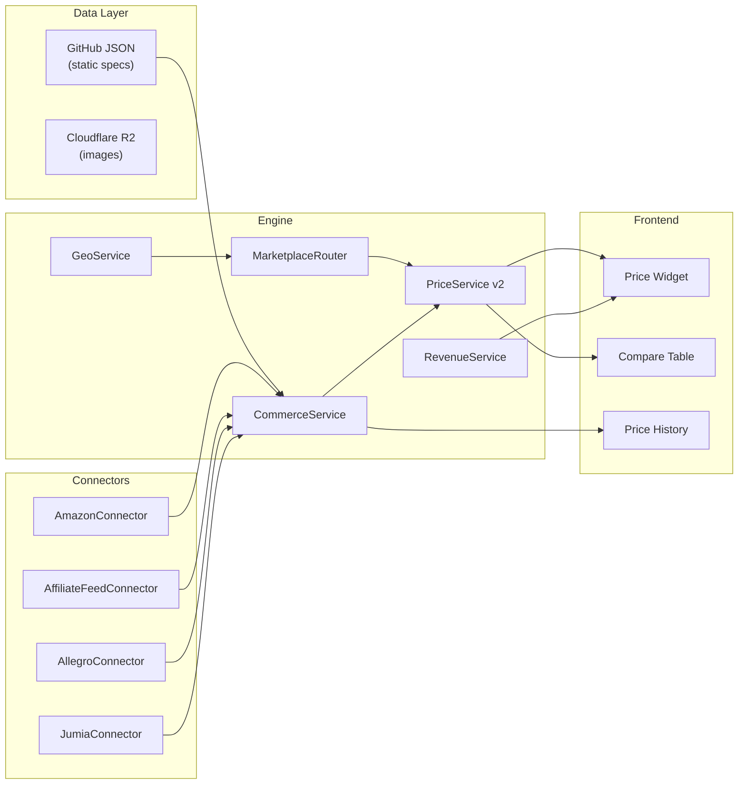

# Marketplace Engine — Implementation Plan

> **Status:** Phases 1–3 Complete · Phases 4–5 Pending  
> **Date:** February 2026

## Overview

Build a modular marketplace engine inside `helmetsan-core` that fetches live pricing from global marketplaces, routes users to the best deal for their country, and monetizes via affiliate links. The engine must be **pluggable** (new marketplaces added without touching core), **geo-aware** (visitor country → relevant stores), and **revenue-first** (affiliate clicks tracked end-to-end).

> [!IMPORTANT]
> The existing `CommerceService`, `RevenueService`, `PriceService`, and `SchedulerService` are already production-deployed. This plan **extends** them — nothing breaks.

## Architecture



---

## Phase 2a — Connector Interface & Amazon

> [!NOTE]
> This is the foundation. Every future marketplace inherits the same contract.

#### [NEW] MarketplaceConnectorInterface.php

```php
interface MarketplaceConnectorInterface {
    public function id(): string;               // e.g. "amazon-us"
    public function supports(string $countryCode): bool;
    public function fetchPrice(string $helmetRef): ?PriceResult;
    public function fetchOffers(string $helmetRef): array;
    public function searchByEan(string $ean): array;
    public function healthCheck(): bool;
}
```

#### [NEW] PriceResult.php

Value object returned by every connector — normalized currency, price, URL, availability.

#### [NEW] ConnectorRegistry.php

```php
$registry->register(new AmazonConnector($config));
$registry->register(new AllegroConnector($config));
$offers = $registry->fetchOffersForCountry('shoei-rf-1400', 'US');
```

#### [NEW] AmazonConnector.php

Amazon SP-API connector:

- Multi-region support (US, UK, DE, IN, JP, AU + 5 more)
- `getItemOffers` by ASIN for live pricing
- EAN → ASIN lookup via `getCatalogItem`
- Rate limiting via `sleep()` + token bucket
- Results cached via WP transients (1-hour TTL)

---

## Phase 2b — Affiliate Feed Ingestion

#### [NEW] AffiliateFeedConnector.php

Generic CSV/XML feed parser for specialist stores:

- Supports RevZilla, Cycle Gear, FC-Moto product feeds
- Maps feed columns to `PriceResult` value object
- Scheduled import via `SchedulerService` cron
- Feed URL + column mapping stored in config

---

## Phase 2c — Allegro Connector

#### [NEW] AllegroConnector.php

- OAuth2 with refresh token stored in `wp_options`
- Search by EAN for motorcycle helmets category
- Price extraction + affiliate link generation
- PL (Poland) market

---

## Phase 2d — Jumia Connector

#### [NEW] JumiaConnector.php

- Supports 7 African markets (NG, KE, EG, MA, GH, UG, TZ)
- Search by keyword + brand filtering
- Price in local currencies (NGN, KES, EGP, MAD)

---

## Phase 3 — Geo-Routing & Price Engine

#### [MODIFY] GeoService.php

Replace stub with real implementation:

- IP → country via CloudFlare `CF-IPCountry` header
- Country → region mapping (22 countries, 6 regions)
- Country → default currency
- Result cached in cookie (24h)

#### [NEW] MarketplaceRouter.php

```php
$router->getMarketplacesForCountry('IN');  // → ['amazon-in']
$router->getMarketplacesForCountry('PL');  // → ['allegro-pl', 'amazon-de']
```

Region-level fallback if no direct country match.

#### [NEW] PriceHistory.php

Custom DB table `wp_helmetsan_price_history`:

| Column         | Type          |
| -------------- | ------------- |
| `helmet_id`    | bigint FK     |
| `marketplace`  | varchar(50)   |
| `country_code` | char(2)       |
| `currency`     | char(3)       |
| `price`        | decimal(10,2) |
| `captured_at`  | datetime      |

---

## Phase 4 — Affiliate & Revenue (Pending)

#### [MODIFY] RevenueService.php

Multi-network affiliate link builder:

| Network           | Link Pattern                       |
| ----------------- | ---------------------------------- |
| Amazon Associates | `amazon.com/dp/{ASIN}?tag={tag}`   |
| Allegro Partner   | `allegro.pl/...?aff_id={id}`       |
| RevZilla/CJ       | CJ deep link with `SID={helmetId}` |
| Jumia KOL         | `jumia.com.ng/...?aff_id={id}`     |

---

## Phase 5 — Frontend Widgets (Pending)

- Price comparison table with "Best Price Today" badge
- Chart.js price history graph (30/90/365 day toggles)
- Geo-localized pricing display

---

## Verification Plan

### Automated Tests

```bash
wp helmetsan test-connector amazon-us --helmet=shoei-rf-1400
wp helmetsan geo-test --ip=103.1.168.1  # → IN → amazon-in
curl -I https://helmetsan.com/go/shoei-rf-1400?source=pdp
```

### Browser Tests

- Visit PDP from US IP → see Amazon US + RevZilla prices
- Visit PDP from IN IP → see Amazon IN prices
- Click "Buy" CTA → verify redirect logs in `wp_helmetsan_clicks`
- Price history chart renders on pages with >1 price record
