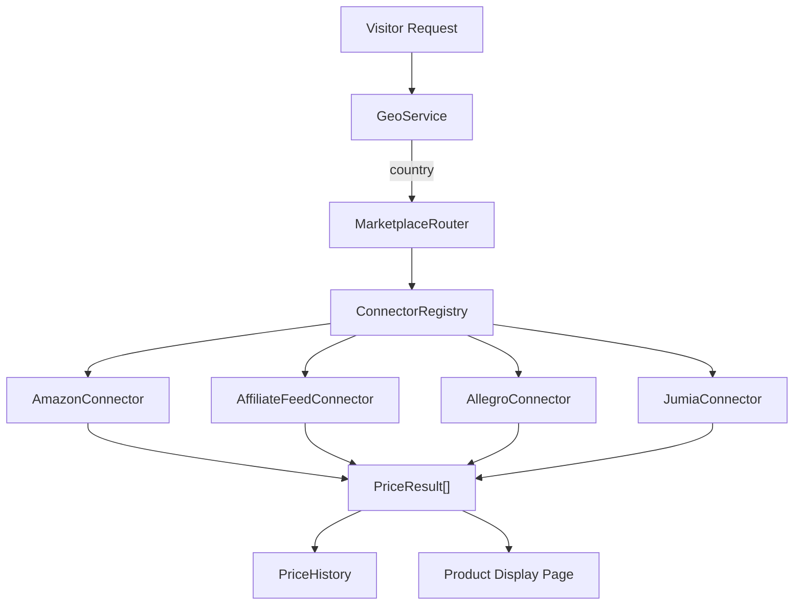

# Marketplace Engine — Walkthrough

> **Date:** February 2026  
> **Phases Completed:** 2 (Connectors) + 3 (Geo-Routing)

## Overview

Built a complete marketplace engine for the Helmetsan WordPress plugin, enabling global helmet price comparison with affiliate monetization across multiple e-commerce platforms.

## Architecture

## Files Created

### Phase 2 — Marketplace Connectors

| File                                                                                                                                                | Purpose                                                  |
| --------------------------------------------------------------------------------------------------------------------------------------------------- | -------------------------------------------------------- |
| [MarketplaceConnectorInterface.php](file:///Users/anumac/Documents/Helmetsan/helmetsan-core/includes/Marketplace/MarketplaceConnectorInterface.php) | Contract all connectors implement                        |
| [PriceResult.php](file:///Users/anumac/Documents/Helmetsan/helmetsan-core/includes/Marketplace/PriceResult.php)                                     | Immutable value object normalizing marketplace responses |
| [ConnectorRegistry.php](file:///Users/anumac/Documents/Helmetsan/helmetsan-core/includes/Marketplace/ConnectorRegistry.php)                         | Central registry with fan-out queries, error isolation   |
| [AmazonConnector.php](file:///Users/anumac/Documents/Helmetsan/helmetsan-core/includes/Marketplace/Connectors/AmazonConnector.php)                  | SP-API, 11 regions, LWA OAuth2, ASIN resolution          |
| [AffiliateFeedConnector.php](file:///Users/anumac/Documents/Helmetsan/helmetsan-core/includes/Marketplace/Connectors/AffiliateFeedConnector.php)    | CSV/XML feed parser for RevZilla, Cycle Gear, FC-Moto    |
| [AllegroConnector.php](file:///Users/anumac/Documents/Helmetsan/helmetsan-core/includes/Marketplace/Connectors/AllegroConnector.php)                | Polish market, OAuth2, offer listing search              |
| [JumiaConnector.php](file:///Users/anumac/Documents/Helmetsan/helmetsan-core/includes/Marketplace/Connectors/JumiaConnector.php)                    | 7 African markets (NG, KE, EG, MA, GH, UG, TZ)           |

### Phase 3 — Geo-Routing & Price Engine

| File                                                                                                                        | Purpose                                                |
| --------------------------------------------------------------------------------------------------------------------------- | ------------------------------------------------------ |
| [GeoService.php](file:///Users/anumac/Documents/Helmetsan/helmetsan-core/includes/Geo/GeoService.php)                       | IP → country detection (CloudFlare → cookie → default) |
| [MarketplaceRouter.php](file:///Users/anumac/Documents/Helmetsan/helmetsan-core/includes/Marketplace/MarketplaceRouter.php) | Country → connector routing with region fallback       |
| [PriceHistory.php](file:///Users/anumac/Documents/Helmetsan/helmetsan-core/includes/Price/PriceHistory.php)                 | `wp_helmetsan_price_history` table for price tracking  |

### Files Modified

| File                                                                                              | Changes                                                              |
| ------------------------------------------------------------------------------------------------- | -------------------------------------------------------------------- |
| [Plugin.php](file:///Users/anumac/Documents/Helmetsan/helmetsan-core/includes/Core/Plugin.php)    | Wired ConnectorRegistry, GeoService, MarketplaceRouter, PriceHistory |
| [Config.php](file:///Users/anumac/Documents/Helmetsan/helmetsan-core/includes/Support/Config.php) | Added `marketplaceConfig()` with defaults + env-var overrides        |

## Key Design Decisions

1. **Pluggable connectors** — All connectors implement `MarketplaceConnectorInterface`, so new marketplaces can be added without modifying the engine core
2. **Region-level fallback** — If no connector serves a visitor's exact country, `MarketplaceRouter` broadens to region siblings (e.g., a visitor from Austria gets EU connectors)
3. **Error isolation** — `ConnectorRegistry::fanOut()` catches exceptions per-connector so one API failure doesn't break the entire price display
4. **Config-driven activation** — Each connector is enabled/disabled via `helmetsan_marketplace` option, with env-var overrides for sensitive API keys

## Marketplace Coverage

| Connector  | Markets    | Countries                                  |
| ---------- | ---------- | ------------------------------------------ |
| Amazon     | 11 regions | US, UK, DE, FR, IT, ES, IN, JP, AU, CA, MX |
| Allegro    | 1          | PL                                         |
| Jumia      | 7          | NG, KE, EG, MA, GH, UG, TZ                 |
| RevZilla   | 1          | US                                         |
| Cycle Gear | 1          | US                                         |
| FC-Moto    | 5          | DE, FR, IT, ES, UK                         |

## Remaining Work

- [ ] PriceService upgrade for multi-currency geo-awareness
- [ ] Affiliate link builder / revenue dashboard enhancements
- [ ] Frontend widgets: "Best Price Today" badge, price comparison, price history chart
