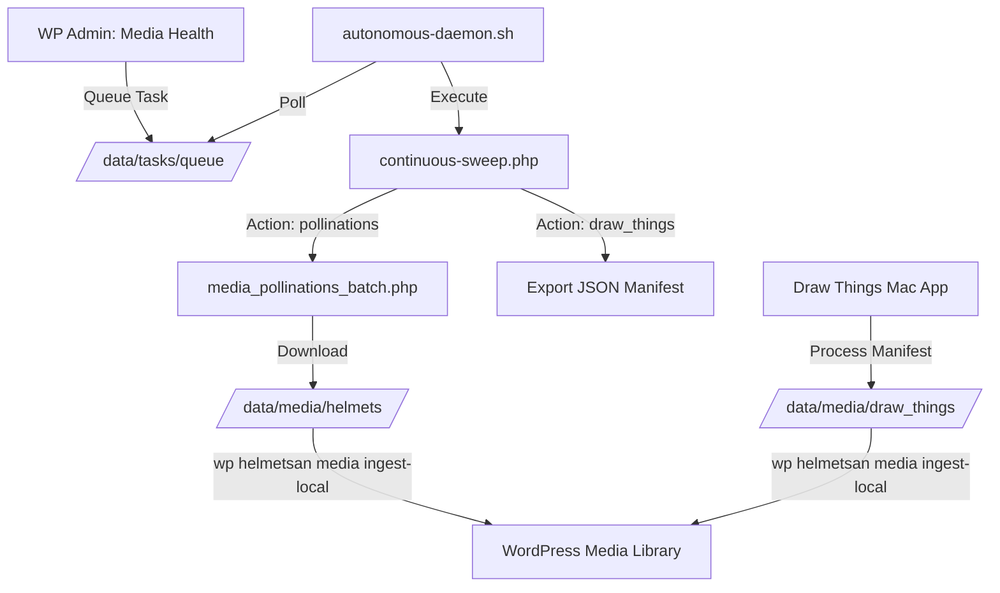

# Media Health & Asset Pipeline

This document outlines the automated pipeline for generating and ingesting high-fidelity assets for the Helmetsan catalog.

## Overview

The Media Health pipeline is a hybrid system that bridges the WordPress Admin UI with local high-performance compute (M4 Pro) and cloud AI (Pollinations.ai) to systematically upgrade the 2,235-helmet catalog from placeholders to cinematic assets.

## Architecture

## Key Components

### 1. Task Queue System
- **Location**: `wp-content/uploads/helmetsan-data/tasks/queue/`
- **Mechanism**: Admin UI writes a JSON manifest to this directory. The background daemon picks it up, starts a `TaskTracker` session, and executes the associated script.
- **Commands**: 
  - `wp helmetsan ai process-queue`: Checks for pending tasks.
  - `wp helmetsan ai task-start --id=ID`: Begins tracking.
  - `wp helmetsan ai task-stop --id=ID`: Ends tracking.

### 2. Generation Engines
- **Pollinations.ai**: `scripts/media_pollinations_batch.php`. Ideal for automated, high-volume background generation.
- **Draw Things (Local GPU)**: `scripts/media_draw_things_api.php`. Uses a JSON manifest exported from the UI to run cinematic renders on local Apple Silicon.

### 3. Ingestion Bridge
The `MediaEngine` has been upgraded to support local file ingestion.
- **Command**: `wp helmetsan media ingest-local --dir=[helmets|draw_things]`
- **Logic**: 
  - Scans the directory for `{id}.png`.
  - Matches ID to a Helmet post.
  - Sideloads the image into the WP Media Library.
  - Sets it as the Featured Image.

### 4. Interactive Certification Badges (SVGs)
To maintain visual excellence, safety certification markings are rendered as interactive vector graphics rather than bitmap placeholders.
- **Path**: `helmetsan-theme/assets/images/certifications/`
- **Supported Standards**: DOT, ECE, Snell, SHARP, ISI, FIM.
- **Features**: Highly optimized SVGs with custom styling, hover animations, and clickable behavior that displays certification detail overlays.

## Workflow

1. **Scan**: Run "Media Health Scan" in **Helmetsan → Media Health**.
2. **Queue**: Click "Generate missing (Pollinations)" or "Export Prompt Manifest".
3. **Daemon**: Ensure `./scripts/autonomous-daemon.sh` is running on the local server.
4. **Ingest**: After files appear in `data/media/`, run the ingestion command to update the live site.

## Future Upgrades
- **Async Webhooks**: Implement a direct callback from the generation scripts to trigger ingestion immediately.
- **Live Progress**: Mirror `TaskTracker` state into the Admin UI for real-time progress bars.
- **Variant Support**: Extend the pipeline to generate unique assets for every colorway (variant) of a helmet.

