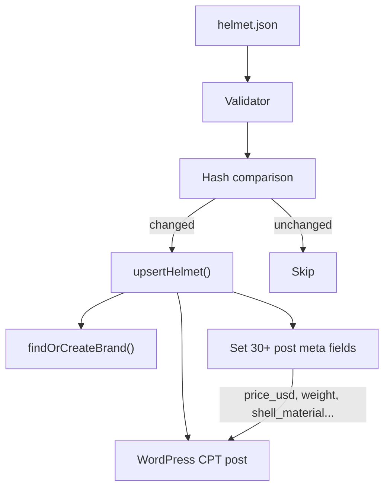

# Ingestion Module

> JSON file → WordPress Custom Post Type processing engine.

## Files

| File                                                                                                                    | Lines | Purpose                      |
| ----------------------------------------------------------------------------------------------------------------------- | ----- | ---------------------------- |
| [IngestionService.php](file:///Users/anumac/Documents/Helmetsan/helmetsan-core/includes/Ingestion/IngestionService.php) | 491   | Batch helmet upsert engine   |
| [LogRepository.php](file:///Users/anumac/Documents/Helmetsan/helmetsan-core/includes/Ingestion/LogRepository.php)       | ~100  | Ingestion log database table |

## What It Does

Converts JSON helmet data files into WordPress `helmet` CPT posts. Handles:

- **Batch processing** with configurable batch size and limit
- **Upsert logic** — creates new or updates existing posts using hash comparison
- **Brand resolution** — auto-creates `brand` terms from helmet data
- **Transaction safety** — DB transactions with rollback on failure
- **Locking** — Transient-based lock prevents concurrent ingestion runs

## Key Methods

| Method                            | Purpose                                          |
| --------------------------------- | ------------------------------------------------ |
| `ingestPath()`                    | Scan a directory and ingest all JSON files       |
| `ingestFiles()`                   | Process a specific list of files with batching   |
| `upsertHelmet()`                  | Create or update a single helmet post            |
| `findHelmetPostId()`              | Resolve external ID → WordPress post ID          |
| `findOrCreateBrand()`             | Auto-create brand taxonomy term                  |
| `buildDescription()`              | Generate helmet description from structured data |
| `acquireLock()` / `releaseLock()` | Prevent concurrent runs                          |

## Data Flow

## Meta Fields Written

The ingestion service writes extensive post meta including: `price_usd`, `price_eur`, `price_gbp`, `weight`, `shell_material`, `visor_type`, `ventilation`, `ean`, `model_year`, `safety_standards`, `variants_json`, `features_json`, `geo_media_json`, and many more.

## Locking Mechanism

Uses WordPress transients to prevent overlapping runs:

- Lock key: `helmetsan_ingest_lock`
- Only one ingestion can run at a time
- `forceUnlock()` available for stuck locks

## Database Table

`wp_helmetsan_ingest_logs` — records every file processed with status (`ok`, `failed`, `rejected`, `skipped`).
