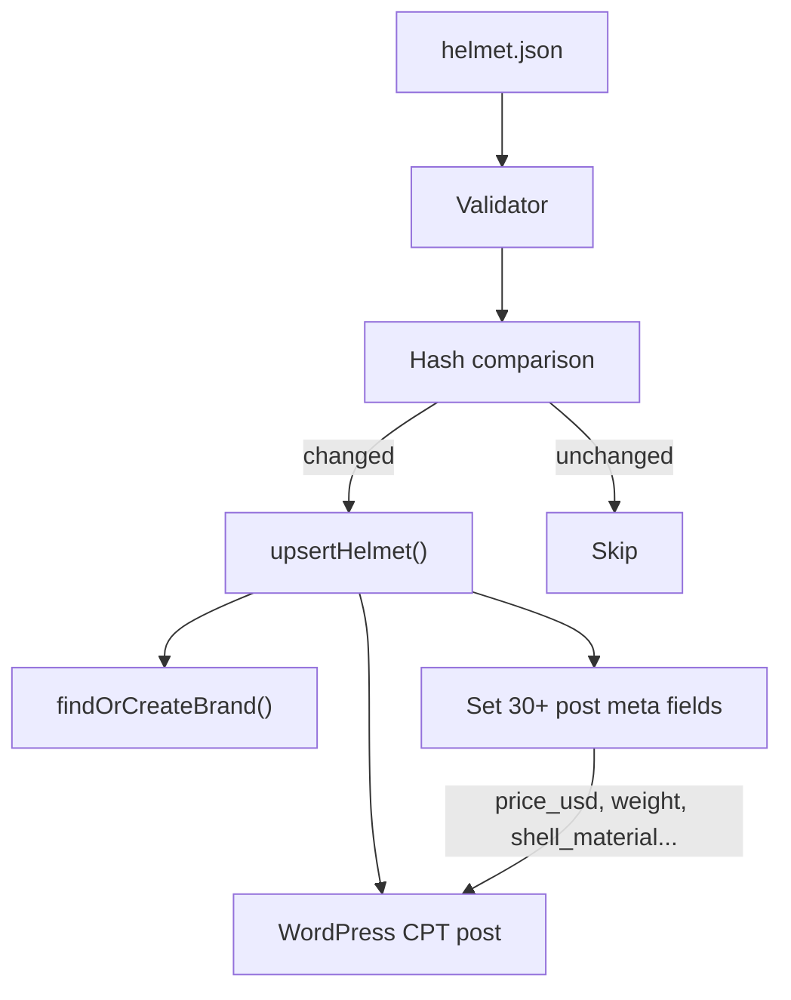

# Ingestion Module

> JSON file → WordPress Custom Post Type processing engine.

## Files

| File                                                                                                                    | Lines | Purpose                      |
| ----------------------------------------------------------------------------------------------------------------------- | ----- | ---------------------------- |
| [IngestionService.php](file:///Users/anumac/Documents/Helmetsan/helmetsan-core/includes/Ingestion/IngestionService.php) | 491   | Batch helmet upsert engine   |
| [LogRepository.php](file:///Users/anumac/Documents/Helmetsan/helmetsan-core/includes/Ingestion/LogRepository.php)       | ~100  | Ingestion log database table |

## What It Does

Converts JSON helmet data files into WordPress `helmet` CPT posts. Handles:

- **Batch processing** with configurable batch size and limit
- **Upsert logic** — creates new or updates existing posts using hash comparison
- **Brand resolution** — auto-creates `brand` terms from helmet data
- **Transaction safety** — DB transactions with rollback on failure
- **Locking** — Transient-based lock prevents concurrent ingestion runs

## Key Methods

| Method                            | Purpose                                          |
| --------------------------------- | ------------------------------------------------ |
| `ingestPath()`                    | Scan a directory and ingest all JSON files       |
| `ingestFiles()`                   | Process a specific list of files with batching   |
| `upsertHelmet()`                  | Create or update a single helmet post            |
| `findHelmetPostId()`              | Resolve external ID → WordPress post ID          |
| `findOrCreateBrand()`             | Auto-create brand taxonomy term                  |
| `buildDescription()`              | Generate helmet description from structured data |
| `acquireLock()` / `releaseLock()` | Prevent concurrent runs                          |

## Data Flow

```mermaid
graph TD
    JSON["helmet.json"] --> VAL["Validator"]
    VAL --> HASH["Hash comparison"]
    HASH -->|"changed"| UPSERT["upsertHelmet()"]
    HASH -->|"unchanged"| SKIP["Skip"]
    UPSERT --> BRAND["findOrCreateBrand()"]
    UPSERT --> META["Set 30+ post meta fields"]
    UPSERT --> WP["WordPress CPT post"]
    META --> |"price_usd, weight, shell_material..."| WP
```

## Meta Fields Written

The ingestion service writes extensive post meta including: `price_usd`, `price_eur`, `price_gbp`, `spec_weight_g`, `spec_shell_material`, `spec_shell_sizes`, `visor_features_json`, `liner_features_json`, `ean`, `model_year` (when present in JSON), `variants_json`, `features_json`, `geo_media_json`, `safety_intelligence_json`, `aero_acoustic_profile_json`, `tech_integration_json`, `fitment_coordinates_json`, and many more. Certifications are also written to the `certification` taxonomy.

### Product identifiers

From the optional `identifiers` object in helmet/accessory JSON, ingestion writes: `ean`, `upc`, `gtin`, `sku`, `mpn`, `fsn`, and `affiliate_asin` (from `identifiers.asin`). Legacy fields are also mapped: `product_details.mfr_product_number` → `mpn`, top-level `sku` → `sku`, and `affiliate.amazon_asin` → `affiliate_asin`. These meta keys power **identifier search** (search by ASIN, EAN, SKU, MPN, FSN) and marketplace feed matching.

### Round-trip and push to GitHub

**ExportService** (Import/Export) builds helmet JSON from WordPress post meta for export. It includes the same fields ingestion writes: `identifiers`, `model_year`, `specs.shell_sizes`, `safety_intelligence`, `aero_acoustic_profile`, `tech_integration`, `fitment_coordinates`, `geo_media`, `key_specs`, `compatible_accessories`, and all other stored JSON blocks. So when you export a helmet to a JSON file and then run sync **push**, the file pushed to GitHub contains the full structure. Ingestion itself does not write to GitHub; see [Sync module](sync.md#ingestion-and-github).

## Locking Mechanism

Uses WordPress transients to prevent overlapping runs:

- Lock key: `helmetsan_ingest_lock`
- Only one ingestion can run at a time (unless lock bypass is used; see below)
- `forceUnlock()` available for stuck locks

## Concurrency (CLI)

The CLI supports parallel ingestion when you pass `--concurrency=N`:

- **`wp helmetsan ingest --path=... --concurrency=N`**  
  Lists JSON files under the path, splits them into N chunks by offset/limit, and spawns N child processes. Each child runs with `HELMETSAN_INGEST_NO_LOCK=1` so they do not contend on the transient lock. Results (created/updated/skipped/rejected) are aggregated and printed once.

- **`wp helmetsan ingest-seed --file=... --concurrency=N`**  
  Reads the seed JSON array, splits it into N chunks, writes N temporary seed files, and spawns N child processes with the lock bypass. Each child ingests its chunk; the parent parses `HELMETSAN_SEED_RESULT` from stdout and aggregates.

**Note:** `HELMETSAN_INGEST_NO_LOCK=1` is for internal use by these CLI concurrency flows. Do not set it when running a single ingest process; the lock is there to prevent accidental overlapping runs.

## Database Table

`wp_helmetsan_ingest_logs` — records every file processed with status (`ok`, `failed`, `rejected`, `skipped`).
