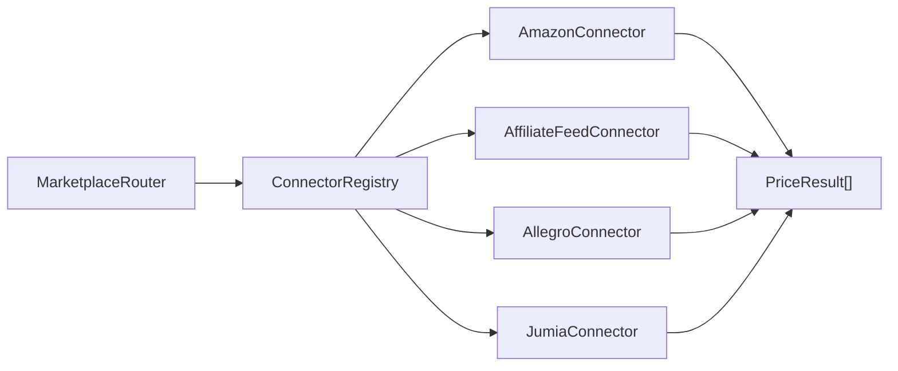

# Marketplace Module

> Multi-marketplace price engine with pluggable connectors.

## Files

| File                                                                                                                                                | Lines | Purpose                                            |
| --------------------------------------------------------------------------------------------------------------------------------------------------- | ----- | -------------------------------------------------- |
| [MarketplaceConnectorInterface.php](file:///Users/anumac/Documents/Helmetsan/helmetsan-core/includes/Marketplace/MarketplaceConnectorInterface.php) | 74    | Contract all connectors implement                  |
| [PriceResult.php](file:///Users/anumac/Documents/Helmetsan/helmetsan-core/includes/Marketplace/PriceResult.php)                                     | 138   | Immutable value object normalizing API responses   |
| [ConnectorRegistry.php](file:///Users/anumac/Documents/Helmetsan/helmetsan-core/includes/Marketplace/ConnectorRegistry.php)                         | 179   | Central registry, fan-out queries, error isolation |
| [MarketplaceRouter.php](file:///Users/anumac/Documents/Helmetsan/helmetsan-core/includes/Marketplace/MarketplaceRouter.php)                         | 130   | Country → connector routing with region fallback   |
| [AmazonConnector.php](file:///Users/anumac/Documents/Helmetsan/helmetsan-core/includes/Marketplace/Connectors/AmazonConnector.php)                  | 336   | Amazon SP-API, 11 regions, OAuth2                  |
| [AffiliateFeedConnector.php](file:///Users/anumac/Documents/Helmetsan/helmetsan-core/includes/Marketplace/Connectors/AffiliateFeedConnector.php)    | 300+  | CSV/XML feed parser for affiliate stores           |
| [AllegroConnector.php](file:///Users/anumac/Documents/Helmetsan/helmetsan-core/includes/Marketplace/Connectors/AllegroConnector.php)                | 310   | Polish market, OAuth2, offer listing               |
| [JumiaConnector.php](file:///Users/anumac/Documents/Helmetsan/helmetsan-core/includes/Marketplace/Connectors/JumiaConnector.php)                    | 230   | 7 African markets, keyword search                  |

## Architecture



## Interface Contract

Every connector must implement:

```php
interface MarketplaceConnectorInterface {
    public function id(): string;
    public function name(): string;
    public function supportedCountries(): array;
    public function supports(string $countryCode): bool;
    public function fetchPrice(string $helmetRef): ?PriceResult;
    public function fetchOffers(string $helmetRef): array;
    public function searchByEan(string $ean): array;
    public function healthCheck(): bool;
}
```

## Connector Coverage

| Connector  | Auth Method                           | Countries                                  | Currency |
| ---------- | ------------------------------------- | ------------------------------------------ | -------- |
| Amazon     | SP-API + LWA OAuth2                   | US, UK, DE, FR, IT, ES, IN, JP, AU, CA, MX | Local    |
| Allegro    | OAuth2 (client credentials / refresh) | PL                                         | PLN      |
| Jumia      | API Key (Bearer)                      | NG, KE, EG, MA, GH, UG, TZ                 | Local    |
| RevZilla   | CSV/XML Feed                          | US                                         | USD      |
| Cycle Gear | CSV/XML Feed                          | US                                         | USD      |
| FC-Moto    | CSV/XML Feed                          | DE, FR, IT, ES, UK                         | EUR      |

## ConnectorRegistry — Fan-Out Query

```php
// Get best price for a helmet in a specific country
$result = $registry->bestPriceForCountry('shoei-rf-1400', 'US');

// Get all offers across all connectors for a country
$offers = $registry->allOffersForCountry('shoei-rf-1400', 'US');

// Fan-out with error isolation per connector
$results = $registry->fanOut('US', fn($connector) => $connector->fetchPrice('shoei-rf-1400'));
```

## Adding a New Connector

1. Create `includes/Marketplace/Connectors/NewConnector.php`
2. Implement `MarketplaceConnectorInterface`
3. Add config keys to `Config::marketplaceDefaults()`
4. Register in `Plugin::buildMarketplace()`

## Configuration

All connector credentials in `helmetsan_marketplace` option. Sensitive keys support env-var overrides:

| Constant                          | Config Key              |
| --------------------------------- | ----------------------- |
| `HELMETSAN_AMZ_CLIENT_ID`         | `amazon_client_id`      |
| `HELMETSAN_AMZ_CLIENT_SECRET`     | `amazon_client_secret`  |
| `HELMETSAN_AMZ_REFRESH_TOKEN`     | `amazon_refresh_token`  |
| `HELMETSAN_ALLEGRO_CLIENT_ID`     | `allegro_client_id`     |
| `HELMETSAN_ALLEGRO_CLIENT_SECRET` | `allegro_client_secret` |
| `HELMETSAN_JUMIA_API_KEY`         | `jumia_api_key`         |
