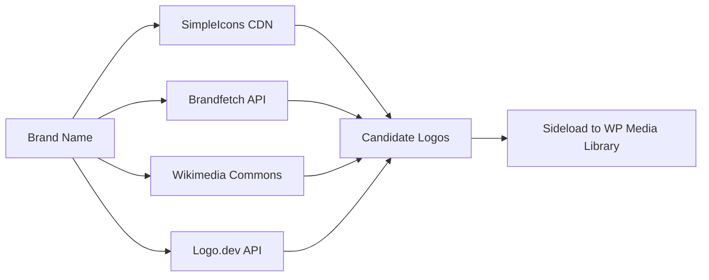

# Media Module

> Brand logo management, product image galleries, and video embedding.

## Files

| File                                                                                                        | Lines | Purpose                                   |
| ----------------------------------------------------------------------------------------------------------- | ----- | ----------------------------------------- |
| [MediaEngine.php](file:///Users/anumac/Documents/Helmetsan/helmetsan-core/includes/Media/MediaEngine.php)   | 1,176 | Logo discovery, sideloading, admin UI     |
| [MediaService.php](file:///Users/anumac/Documents/Helmetsan/helmetsan-core/includes/Media/MediaService.php) | 179   | Video meta boxes, product gallery builder |

## MediaEngine

The largest media service — handles brand logo discovery and management:

### Logo Discovery Sources

### Key Features

- **Multi-provider logo discovery** — SimpleIcons → Brandfetch → Wikimedia → Logo.dev
- **Domain heuristics** — Generates domain candidates from brand names
- **SVG support** — Custom MIME type registration for SVG uploads
- **Batch backfill** — `backfillBrandLogos()` auto-fetches missing logos
- **Duplicate detection** — Checks existing media by source URL before sideloading
- **Admin UI** — Full management page under Helmetsan menu

### Admin Page

WP Admin page for bulk logo operations:

- View all brands and their logo status
- Trigger logo discovery per brand
- Apply selected logos from candidates
- Delete and re-fetch logos

## MediaService

Handles video and gallery data:

| Method                | Purpose                                                       |
| --------------------- | ------------------------------------------------------------- |
| `getProductGallery()` | Build gallery from featured image + `geo_media_json` + videos |
| `getBrandVideo()`     | Get brand spotlight YouTube URL                               |
| `getEmbedCode()`      | Generate YouTube embed iframe                                 |
| `getVideoThumbnail()` | Fetch YouTube thumbnail URL                                   |

### Product Gallery Sources (priority order)

1. WordPress featured image (attachment)
2. External images from `geo_media_json` post meta (Cloudflare R2 URLs)
3. Video embeds from `helmet_videos_json` post meta

## Configuration

Logo discovery API keys in `Config::mediaConfig()`:

| Key                | Env Override                 | Description        |
| ------------------ | ---------------------------- | ------------------ |
| `brandfetch_token` | `HELMETSAN_BRANDFETCH_TOKEN` | Brandfetch API key |
| `logodev_token`    | `HELMETSAN_LOGODEV_TOKEN`    | Logo.dev API key   |
