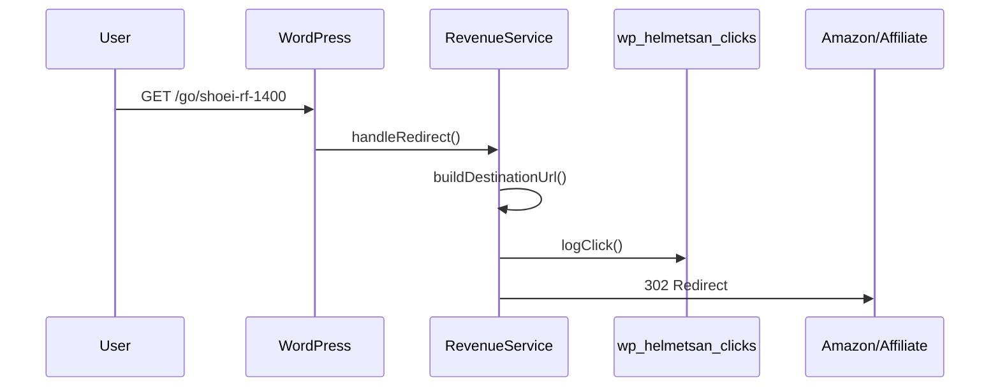

# Revenue Module

> Affiliate link tracking, click logging, and revenue reporting.

## Files

| File                                                                                                              | Lines | Purpose                              |
| ----------------------------------------------------------------------------------------------------------------- | ----- | ------------------------------------ |
| [RevenueService.php](file:///Users/anumac/Documents/Helmetsan/helmetsan-core/includes/Revenue/RevenueService.php) | 249   | Click tracking, redirects, reporting |

## How It Works

### Redirect System

Visitors click `/go/{helmet-slug}` → RevenueService intercepts → logs the click → redirects to destination.



### URL Resolution Priority

1. Custom `affiliate_url` post meta (any URL)
2. Amazon link from `affiliate_asin` post meta + configured tag
3. Fallback: helmet permalink

### Click Data Captured

| Field               | Description                                                |
| ------------------- | ---------------------------------------------------------- |
| `helmet_id`         | WordPress post ID                                          |
| `click_source`      | `?source=` param (e.g., "pdp", "comparison", "email")      |
| `affiliate_network` | Configured network name                                    |
| `destination_url`   | Final redirect target                                      |
| `referer`           | HTTP referer header                                        |
| `user_agent`        | Browser user agent                                         |
| `ip_hash`           | SHA-256 hash of IP + salt (for fraud detection, GDPR-safe) |

## Database Table

`wp_helmetsan_clicks`:

```sql
CREATE TABLE wp_helmetsan_clicks (
    id bigint(20) unsigned AUTO_INCREMENT,
    created_at datetime NOT NULL,
    helmet_id bigint(20) unsigned NOT NULL,
    click_source varchar(50) NOT NULL,
    affiliate_network varchar(50) NOT NULL,
    destination_url text NOT NULL,
    referer text,
    user_agent text,
    ip_hash varchar(64),
    -- Indexed: helmet_id, click_source, affiliate_network, created_at
);
```

## Revenue Reports

`report(int $days = 30)` returns:

```php
[
    'total_clicks' => 1234,
    'by_source'    => ['pdp' => 800, 'comparison' => 300, ...],
    'by_network'   => ['amazon' => 900, 'revzilla' => 200, ...],
    'top_helmets'  => [
        ['helmet_id' => 42, 'title' => 'Shoei RF-1400', 'clicks' => 150],
        // ...
    ],
]
```

## Configuration

Via `Config::revenueConfig()`:

| Key                         | Default        | Description                               |
| --------------------------- | -------------- | ----------------------------------------- |
| `enable_redirect_tracking`  | `true`         | Enable/disable the `/go/` redirect system |
| `amazon_tag`                | `helmetsan-20` | Amazon Associates tag                     |
| `default_affiliate_network` | `affiliate`    | Default network label                     |
| `redirect_status_code`      | `302`          | HTTP redirect code (301, 302, 307, 308)   |
