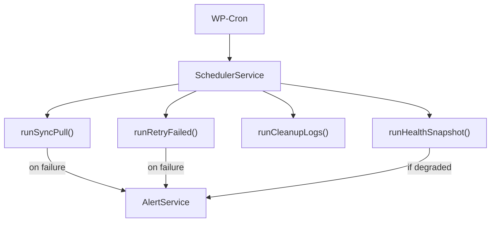

# Scheduler Module

> WP-Cron job orchestration for automated data synchronization.

## Files

| File                                                                                                                    | Lines | Purpose                   |
| ----------------------------------------------------------------------------------------------------------------------- | ----- | ------------------------- |
| [SchedulerService.php](file:///Users/anumac/Documents/Helmetsan/helmetsan-core/includes/Scheduler/SchedulerService.php) | 308   | 4 cron jobs + task runner |

## Cron Jobs

| Hook                             | Task                  | Default Interval | Description                        |
| -------------------------------- | --------------------- | ---------------- | ---------------------------------- |
| `helmetsan_cron_sync_pull`       | `runSyncPull()`       | Every 6 hours    | Pull data from GitHub              |
| `helmetsan_cron_retry_failed`    | `runRetryFailed()`    | Every 2 hours    | Retry failed ingestion files       |
| `helmetsan_cron_cleanup_logs`    | `runCleanupLogs()`    | Daily            | Prune old log entries              |
| `helmetsan_cron_health_snapshot` | `runHealthSnapshot()` | Every 12 hours   | Store health report for monitoring |

## Architecture

## Key Methods

| Method         | Purpose                                          |
| -------------- | ------------------------------------------------ |
| `register()`   | Register cron hooks and schedule events          |
| `activate()`   | Schedule events on plugin activation             |
| `deactivate()` | Clear all scheduled hooks                        |
| `status()`     | Return next-run times for all jobs               |
| `runTask()`    | Execute a named task (for WP-CLI manual trigger) |
| `maybeAlert()` | Check task result and send alert if needed       |

## Alerting

After each task runs, `maybeAlert()` checks the result. If a task fails or health is degraded, it fires `AlertService::send()` with the context.

## Configuration

Via `Config::schedulerConfig()`:

| Key                        | Default | Description                 |
| -------------------------- | ------- | --------------------------- |
| `enable_scheduler`         | `true`  | Master toggle               |
| `sync_pull_interval_hours` | `6`     | GitHub pull frequency       |
| `retry_interval_hours`     | `2`     | Failed file retry frequency |
| `cleanup_retention_days`   | `30`    | Days to keep log entries    |
| `health_interval_hours`    | `12`    | Health snapshot frequency   |
