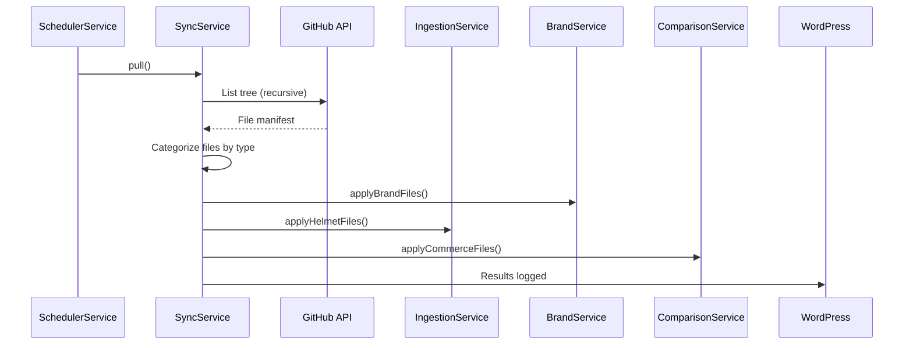

# Sync Module

> GitHub ↔ WordPress bidirectional data synchronization.

## Files

| File                                                                                                         | Lines | Purpose                                  |
| ------------------------------------------------------------------------------------------------------------ | ----- | ---------------------------------------- |
| [SyncService.php](file:///Users/anumac/Documents/Helmetsan/helmetsan-core/includes/Sync/SyncService.php)     | 1,495 | Core sync engine — pull/push GitHub data |
| [LogRepository.php](file:///Users/anumac/Documents/Helmetsan/helmetsan-core/includes/Sync/LogRepository.php) | ~100  | Sync log database table management       |

## What It Does

`SyncService` is the largest service in the plugin. It handles:

1. **Pull** — Fetches JSON files from GitHub, categorizes them by entity type, and applies them to WordPress
2. **Push** — Exports WordPress data back to GitHub (commit or PR mode)
3. **File routing** — Auto-detects entity type from file paths (brands, helmets, accessories, motorcycles, safety standards, dealers, distributors, comparisons, recommendations, commerce)

## Pull Flow



## Key Methods

| Method                       | Purpose                                                          |
| ---------------------------- | ---------------------------------------------------------------- |
| `pull()`                     | Main entry — fetches GitHub tree, categorizes, and applies files |
| `applyBrandFiles()`          | Process brand JSON → BrandService                                |
| `applyHelmetFiles()`         | Process helmet JSON → IngestionService                           |
| `applyAccessoryFiles()`      | Process accessories                                              |
| `applyMotorcycleFiles()`     | Process motorcycles                                              |
| `applySafetyStandardFiles()` | Process ECE/DOT/Snell standards                                  |
| `applyDealerFiles()`         | Process dealer directory                                         |
| `applyDistributorFiles()`    | Process distributors                                             |
| `applyComparisonFiles()`     | Process comparison data                                          |
| `applyRecommendationFiles()` | Process recommendation data                                      |
| `applyCommerceFiles()`       | Process pricing/offers/marketplace data                          |

## Sync Profiles

| Profile     | Description                                   |
| ----------- | --------------------------------------------- |
| `pull-only` | Download from GitHub, don't push changes back |
| `push-only` | Push local data to GitHub                     |
| `full-sync` | Bidirectional sync                            |

## Configuration

```php
$config->githubConfig();
// Returns:
[
    'owner'       => 'ashishdungdung',
    'repo'        => 'helmetsan',
    'token'       => '***',
    'branch'      => 'main',
    'remote_path' => 'data/',
    'push_mode'   => 'commit', // or 'pr'
]
```

## Database Table

`wp_helmetsan_sync_logs` — records every sync action with status, file count, and error details.
