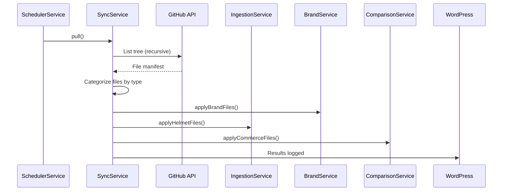

# Sync Module

> GitHub ↔ WordPress bidirectional data synchronization.

## Files

| File                                                                                                         | Lines | Purpose                                  |
| ------------------------------------------------------------------------------------------------------------ | ----- | ---------------------------------------- |
| [SyncService.php](file:///Users/anumac/Documents/Helmetsan/helmetsan-core/includes/Sync/SyncService.php)     | 1,495 | Core sync engine — pull/push GitHub data |
| [LogRepository.php](file:///Users/anumac/Documents/Helmetsan/helmetsan-core/includes/Sync/LogRepository.php) | ~100  | Sync log database table management       |

## What It Does

`SyncService` is the largest service in the plugin. It handles:

1. **Pull** — Fetches JSON files from GitHub, categorizes them by entity type, and applies them to WordPress
2. **Push** — Uploads local JSON files from the repo to GitHub (commit or PR mode). To update GitHub with WordPress data, export entities to JSON first, then push.
3. **File routing** — Auto-detects entity type from file paths (brands, helmets, accessories, motorcycles, safety standards, dealers, distributors, comparisons, recommendations, commerce)

## Pull Flow


```mermaid
sequenceDiagram
    participant Sched as SchedulerService
    participant Sync as SyncService
    participant GH as GitHub API
    participant Ing as IngestionService
    participant Brand as BrandService
    participant Cmp as ComparisonService
    participant WP as WordPress

    Sched->>Sync: pull()
    Sync->>GH: List tree (recursive)
    GH-->>Sync: File manifest
    Sync->>Sync: Categorize files by type
    Sync->>Brand: applyBrandFiles()
    Sync->>Ing: applyHelmetFiles()
    Sync->>Cmp: applyCommerceFiles()
    Sync->>WP: Results logged
```

## Key Methods

| Method                       | Purpose                                                          |
| ---------------------------- | ---------------------------------------------------------------- |
| `pull()`                     | Main entry — fetches GitHub tree, categorizes, and applies files |
| `applyBrandFiles()`          | Process brand JSON → BrandService                                |
| `applyHelmetFiles()`         | Process helmet JSON → IngestionService                           |
| `applyAccessoryFiles()`      | Process accessories                                              |
| `applyMotorcycleFiles()`     | Process motorcycles                                              |
| `applySafetyStandardFiles()` | Process ECE/DOT/Snell standards                                  |
| `applyDealerFiles()`         | Process dealer directory                                         |
| `applyDistributorFiles()`    | Process distributors                                             |
| `applyComparisonFiles()`     | Process comparison data                                          |
| `applyRecommendationFiles()` | Process recommendation data                                      |
| `applyCommerceFiles()`       | Process pricing/offers/marketplace data                          |

## Sync Profiles (pull apply)

Pull **downloads** files from GitHub; these profiles control **what gets applied** after download:

| Profile        | Apply brands | Apply helmets (and accessories via ingest) | Use case                          |
| -------------- | ------------ | ------------------------------------------- | --------------------------------- |
| `pull-only`    | No           | No                                          | Download only; apply manually     |
| `pull+brands`  | Yes          | No                                          | Brands only                        |
| `pull+helmets` | No           | Yes                                         | Helmets + accessories only         |
| `pull+all`     | Yes          | Yes                                         | Brands + helmets + accessories    |

Set in **Helmetsan → GitHub** as “Sync run profile”; override with `--profile=pull+brands`, `--profile=pull+helmets`, or `--profile=pull+all` on the CLI unless profile lock is enabled.

## Delete and rename behavior

Sync is **add/update only**:

- **File deleted on GitHub:** The plugin does not compare the previous tree to the current one. A removed file is **not** reflected in WordPress: the corresponding post is **not** deleted or unpublished. You must manually unpublish or remove the entity if you want it gone.
- **File renamed on GitHub:** A renamed file appears as a new path and is applied as a new file. The old path is no longer in the tree. There is no “same entity, new path” detection. Depending on payload `id`, you can get two posts (old + new) or one updated post (if `id` is the same and upsert merges). Prefer keeping the same `id` in the payload when renaming files.

**Manual cleanup:** After removing or renaming files in GitHub, run ingest/sync as needed and then review the catalog in admin; unpublish or delete any orphaned or duplicate posts by hand.

## Ingestion and GitHub

**Ingestion does not update GitHub.** It only **reads** JSON (from disk, e.g. after a pull) and writes to WordPress. Data flow:

- **Pull:** GitHub → download JSON to local repo → Ingestion (or BrandService, etc.) applies files → WordPress is updated.
- **Push:** Local JSON files on disk (e.g. under `data/helmets/`) are uploaded to GitHub as-is. No export step is run automatically.

To get WordPress changes (including new meta) into GitHub: export helmets (or other entities) to JSON using **ExportService** (or CLI export), then run sync **push**. ExportService builds JSON from post meta and includes all ingested fields (identifiers, safety_intelligence, aero_acoustic_profile, tech_integration, fitment_coordinates, model_year, spec_shell_sizes, etc.) so the exported file is round-trip safe and ready to push.

## Configuration

```php
$config->githubConfig();
// Returns:
[
    'owner'       => 'ashishdungdung',
    'repo'        => 'helmetsan',
    'token'       => '***',
    'branch'      => 'main',
    'remote_path' => 'data/',
    'push_mode'   => 'commit', // or 'pr'
]
```

## Database Table

`wp_helmetsan_sync_logs` — records every sync action with status, file count, and error details.
