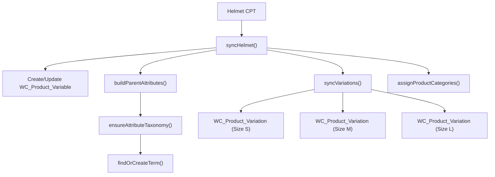

# WooBridge Module

> Synchronizes helmet CPT data into WooCommerce variable products.

## Files

| File                                                                                                                    | Lines | Purpose                           |
| ----------------------------------------------------------------------------------------------------------------------- | ----- | --------------------------------- |
| [WooBridgeService.php](file:///Users/anumac/Documents/Helmetsan/helmetsan-core/includes/WooBridge/WooBridgeService.php) | 478   | Helmet → WooCommerce product sync |

## What It Does

Converts Helmetsan `helmet` custom post types into WooCommerce `product` posts with variations for different sizes/colors.

## Sync Flow

## Key Methods

| Method                      | Purpose                                        |
| --------------------------- | ---------------------------------------------- |
| `syncHelmet()`              | Sync a single helmet → WooCommerce product     |
| `syncBatch()`               | Bulk sync up to N helmets                      |
| `maybeSyncOnSave()`         | Auto-sync when helmet post is saved            |
| `syncVariations()`          | Create WC variations from `variants_json`      |
| `buildParentAttributes()`   | Build WC attribute objects for size/color      |
| `ensureAttributeTaxonomy()` | Register WC attribute taxonomy if missing      |
| `assignProductCategories()` | Map helmet type → WooCommerce product category |

## Data Mapping

| Helmet Meta          | WooCommerce Field  |
| -------------------- | ------------------ |
| `post_title`         | Product title      |
| `post_content`       | Short description  |
| `price_usd`          | Regular price      |
| `sku` / `post_name`  | SKU                |
| `variants_json`      | Product variations |
| Helmet type taxonomy | Product categories |
| Brand taxonomy       | Product tag        |

## Configuration

Via `Config::wooBridgeConfig()`:

| Key                    | Default   | Description               |
| ---------------------- | --------- | ------------------------- |
| `enabled`              | `false`   | Master toggle             |
| `auto_sync_on_save`    | `true`    | Sync when helmet is saved |
| `default_stock_status` | `instock` | WooCommerce stock status  |

## Prerequisites

- WooCommerce must be installed and activated
- `available()` method checks `class_exists('WooCommerce')`
